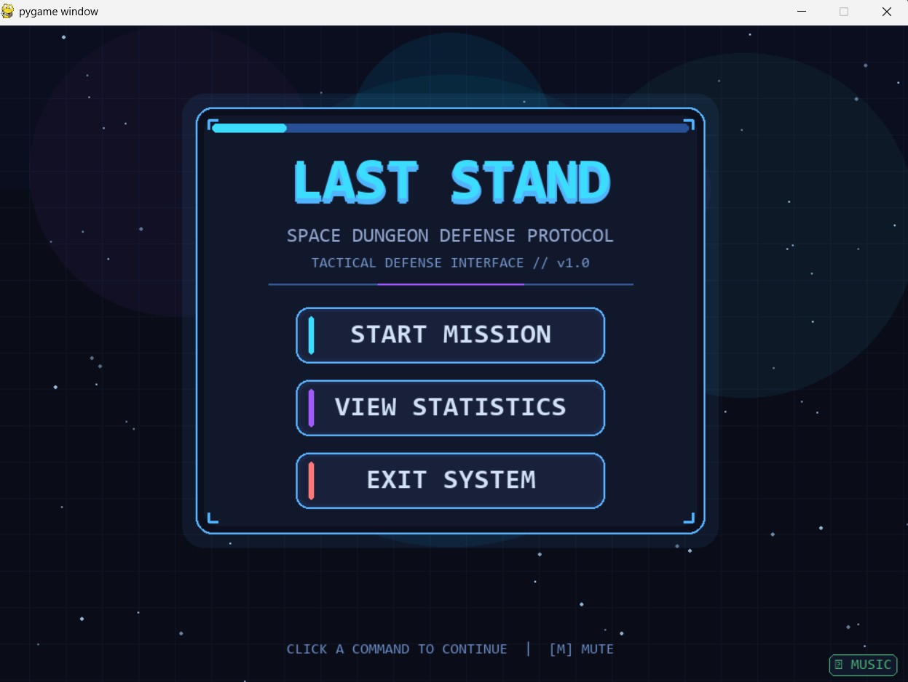
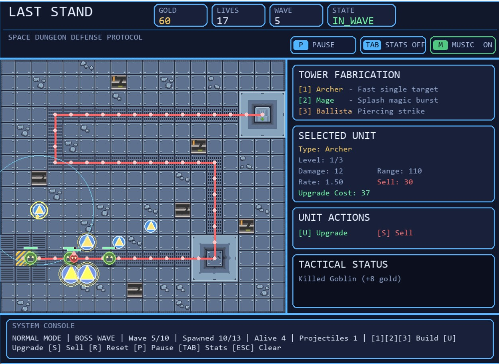
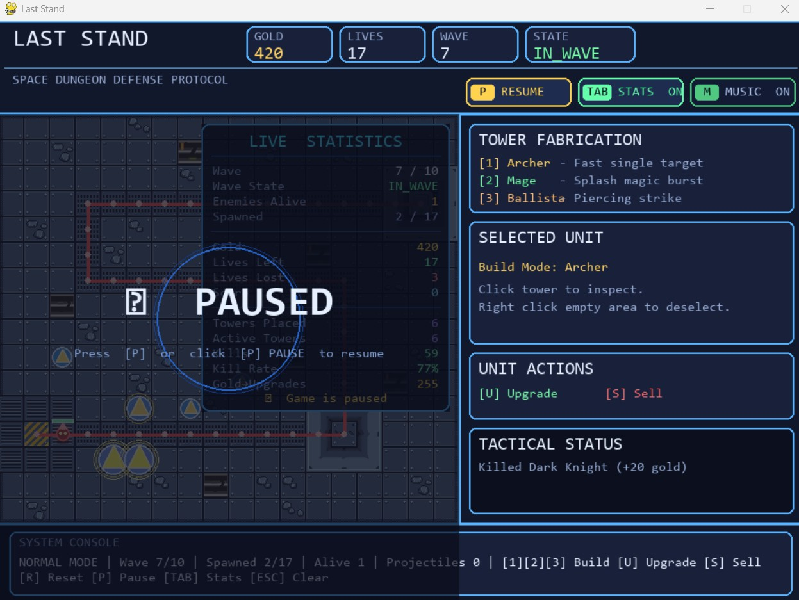
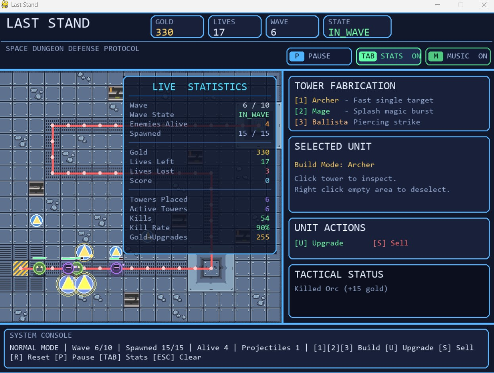
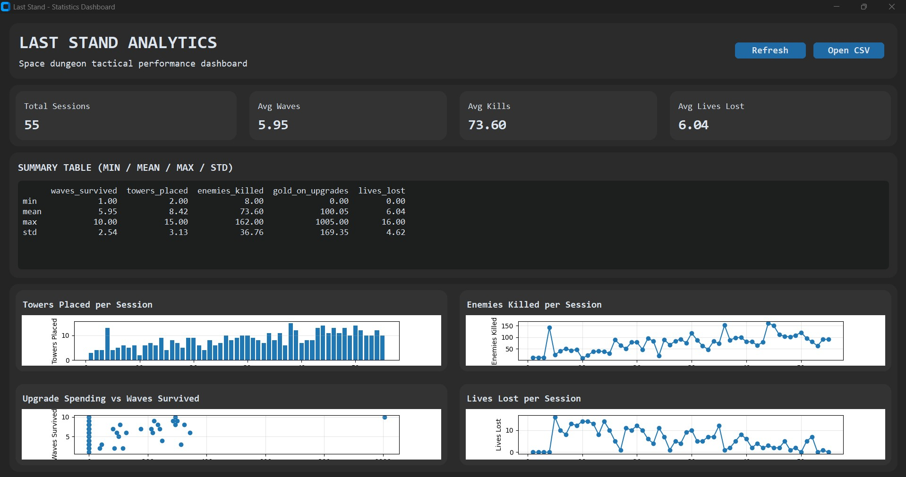
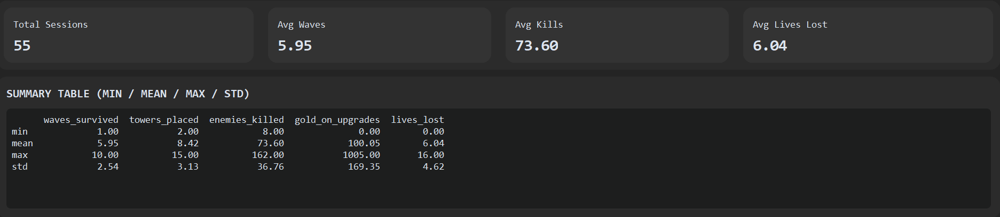
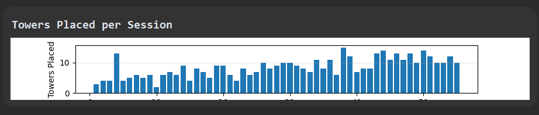
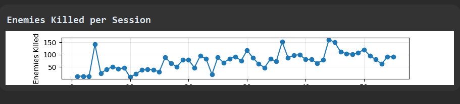
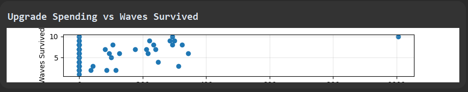

# Project Description

## 1. Project Overview

- **Project Name:** Last Stand

- **Brief Description:**

  Last Stand is a top-down grid-based tower defense game built with Python and Pygame-CE, set in a space dungeon. The player places and upgrades towers on a fixed tile map to defend their base from waves of enemies following a preset path. Three distinct tower types — Archer, Mage, and Ballista — each have different stats and attack behaviors, and can be upgraded up to three levels. Four enemy types with varying HP, speed, and armor escalate across ten waves, with a boss enemy appearing on key waves.

  Beyond the core game, Last Stand includes a **custom map editor** for designing new maps visually, and a **standalone Statistics Dashboard** built with customtkinter and matplotlib that visualizes session performance data logged to CSV — letting players track and analyze their improvement over time.

- **Problem Statement:**

  Tower defense games often feel repetitive because players have no visibility into their own tendencies. Do they over-invest in upgrades? Do they consistently lose lives on early waves? Last Stand addresses this by pairing the gameplay with a persistent statistics system and dashboard, turning each session into a data point so players can identify patterns and improve their strategy across runs.

- **Target Users:**

  Players who enjoy tactical strategy games with short session times. Also suitable for students or developers interested in how a Pygame game can be paired with a data analytics layer built on customtkinter and matplotlib.

- **Key Features:**
  - 3 tower types (Archer, Mage, Ballista) each with 3 upgrade levels — damage, range, and fire rate scale per level, with distinct visual changes per level
  - 4 enemy types (Goblin, Orc, Dark Knight, Boss) with individual armor values, glow, and trail visual effects
  - 10 configurable waves with escalating enemy counts and compositions
  - Grid-based 18×16 tile map with path, build, spawn, and base tile types
  - Custom visual map editor (`editor_main.py`) for creating and saving new maps as JSON
  - Session statistics automatically logged to `data/sessions.csv` after every game
  - Standalone analytics dashboard (`dashboard_main.py`) with 4 matplotlib charts and a summary statistics table
  - Background music with scene-based switching via `MusicManager`
  - Space dungeon visual theme — dark blue/cyan color palette throughout all UI

- **Screenshots:**

  ### Gameplay

  
  
  
  

  ### Data Dashboard

  
  
  
  
  

- **Proposal:** [Project Proposal](./proposal.pdf)

- **YouTube Presentation:** _(Add your YouTube link here)_

---

## 2. Concept

### 2.1 Background

Last Stand was designed to explore what a tower defense game feels like when it also acts as a personal performance tracker. Most tower defense games reset completely between sessions with no persistent record of what happened, meaning players can repeat the same strategic mistakes without ever realizing it.

This project was inspired by the idea that game data is gameplay — knowing that upgrade spending correlates with survival turns the dashboard into a strategic tool, not just a stats screen. The space dungeon setting was chosen to give the game a distinct visual identity: glowing enemies with motion trails, cyan tower beams, and a dark blue grid that stands apart from typical fantasy tower defense aesthetics.

### 2.2 Objectives

- Build a fully playable tower defense loop with clear win and lose conditions across 10 waves
- Implement a clean OOP inheritance hierarchy separating base classes (`Tower`, `Enemy`) from concrete subtypes
- Create a custom tile-based map editor that produces JSON map files directly loadable by the game
- Record meaningful per-session gameplay statistics to CSV in a structured, append-safe format
- Visualize that data in a standalone analytics dashboard using customtkinter and matplotlib
- Deliver a consistent visual style and responsive UI across both the game and the dashboard

---

## 3. UML Class Diagram

The UML class diagram shows all major classes, their attributes, key methods, and relationships including inheritance and association.

**Key Inheritance Trees:**

- `Tower → ArcherTower / MageTower / BallistaTower`
- `Enemy → Goblin / Orc / DarkKnight / BossEnemy`

**Attachment:** [UML Class Diagram](./uml.pdf)

---

## 4. Object-Oriented Programming Implementation

- **`Game`** — Top-level controller in `main.py`. Owns the main game loop, manages all state transitions (start screen → gameplay → game over), routes events, and coordinates every subsystem.

- **`Player`** — Holds the player's current gold and lives, and tracks session-level counters: `towers_placed`, `enemies_killed`, `gold_on_upgrades`, and `lives_lost`. Updated by game events rather than controlling a character directly.

- **`Tower`** _(abstract base)_ — Base class for all tower types. Implements targeting logic (furthest-along enemy within range), attack cooldown timing, 3-level upgrade stat scaling, sell value calculation, and range-circle drawing when selected.

- **`ArcherTower`** — Subclass of `Tower`. Fast fire rate, low damage. Fires single-target arrow projectiles. Visually represented as a blue circle with a yellow triangle arrow that grows larger at each upgrade level.

- **`MageTower`** — Subclass of `Tower`. Slow fire rate, high damage. Fires single-target magic orb projectiles. Visually represented as concentric circles that expand and gain additional glow rings with each upgrade level.

- **`BallistaTower`** — Subclass of `Tower`. Medium fire rate, piercing bolt that passes through multiple enemies. Visually represented as a rectangle with an X cross that grows in size and gains corner accents and an outer glow at higher levels.

- **`Enemy`** _(abstract base)_ — Base class for all enemy types. Handles waypoint-based pathfinding, armor-reduced damage calculation, HP bar rendering, glow and motion trail visual effects, and base-reached detection.

- **`Goblin`** — Subclass of `Enemy`. Fast movement speed, low HP, no armor.

- **`Orc`** — Subclass of `Enemy`. Slow movement, high HP, moderate armor.

- **`DarkKnight`** — Subclass of `Enemy`. Medium speed and HP, high armor value.

- **`BossEnemy`** — Subclass of `Enemy`. Very large HP pool with an aura visual effect, appears on key waves.

- **`Projectile`** — Moves toward a target enemy each frame. Deals damage on contact and is removed on hit. Ballista bolts use a pierce mode to pass through multiple targets before expiring.

- **`WaveManager`** — Controls enemy spawn scheduling across all 10 waves. Reads wave configurations to determine enemy type counts and spawn intervals. Tracks the current wave number and detects the victory condition.

- **`MapLoader`** — Loads tile maps from JSON files in `data/maps/`. Returns the tile type grid and a precomputed list of waypoint coordinates for enemy pathfinding.

- **`StatisticsManager`** — Writes one row of session data to `data/sessions.csv` at the end of each game. Opens the file in append mode, handles first-run file creation, validates and auto-repairs column headers, and manages auto-incrementing `session_id` values.

- **`SceneManager`** — Manages transitions between the start screen, active gameplay, and game-over scenes.

- **`MusicManager`** — Loads background music tracks and switches them based on the current scene using Pygame's mixer with fade in/out.

- **`HUD`** — Renders the top header bar (wave counter, gold, lives remaining) and the right-side panel (tower selection buttons, upgrade/sell details for the selected tower, wave start button).

- **`StartScreen`** — Animated title screen with a Play button and the space dungeon visual theme applied consistently.

- **`StatsDashboardApp`** _(customtkinter)_ — Standalone analytics window launched via `dashboard_main.py`. Loads `sessions.csv` through `StatisticsManager`, computes aggregate statistics, and embeds four matplotlib charts using `FigureCanvasTkAgg`.

---

## 5. Statistical Data

### 5.1 Data Recording Method

Session data is recorded by the `StatisticsManager` class at the end of each game, regardless of win or loss outcome. The file `data/sessions.csv` is opened in **append mode** so data accumulates across all sessions without overwriting previous runs. Each row represents one complete game session and is assigned an auto-incrementing `session_id`. If the file is missing or has corrupted headers, `StatisticsManager` automatically creates or repairs it before writing.

### 5.2 Data Features

| Column             | Type | Description                                                  |
| ------------------ | ---- | ------------------------------------------------------------ |
| `session_id`       | int  | Auto-incrementing unique identifier for each session         |
| `waves_survived`   | int  | Number of waves completed before game over (max 10 on a win) |
| `towers_placed`    | int  | Total number of towers placed during the session             |
| `enemies_killed`   | int  | Total enemies killed across all waves                        |
| `gold_on_upgrades` | int  | Total gold spent upgrading towers during the session         |
| `lives_lost`       | int  | Number of lives lost to enemies reaching the base            |
| `result`           | str  | Final session outcome: `win` or `lose`                       |

These seven features were chosen to cover the four core decisions a player makes each session: how aggressively they build (`towers_placed`), how effectively they defend (`enemies_killed`, `waves_survived`), how they invest their gold (`gold_on_upgrades`), and how well they hold the line (`lives_lost`). Together they provide a complete tactical profile of each run and enable meaningful comparisons across sessions in the dashboard.

---

## 6. Changed Proposed Features

All originally proposed features have been implemented as planned. No changes were made to the proposal scope.

---

## 7. External Sources

All assets are sourced from open-source or royalty-free repositories. Attribution details are included in the `assets/` folder.
